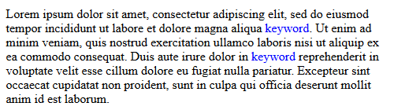

# Synhi - simple syntax highlighter

Synhi is a tool in one function to create own syntax themes.

## How to use:

### 1. Insert code in your project
That's all code you need: [synhi.js](synhi.js).

### 2. Add CSS classes you need

Example:

```css
.hl_keyword {color: blue;}
```

### 3. Highlight your text

Call the function and pass element with text, regex rule to find it and class that will highlight the text.

```javascript
highlight(target_element, /(keyword)/, "hl_keyword");
```
### 4. Enjoy

That result you will get:



### Demo with ini syntax
This example does not cover the entire ini syntax; it is made to show the capabilities of the tool.

https://jsfiddle.net/ColdSpirit/6v74p8x5/

Demo backup: [demo_ini.html](demo_ini.html)
